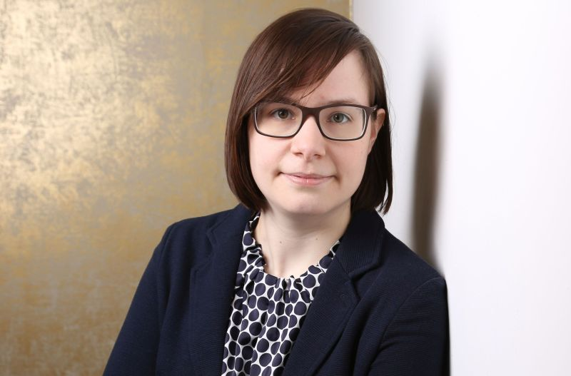

---
# You don't need to edit this file, it's empty on purpose.
# Edit theme's home layout instead if you wanna make some changes
# See: https://jekyllrb.com/docs/themes/#overriding-theme-defaults
layout: home
---

My name is Janine George and I am currently junior group leader at the <a href="https://www.bam.de/Navigation/EN/Home/home.html">Federal Intitute for Materials Research and Testing in Germany</a>. On this website, you will find information on my person and my research. My current research focuses on data analysis and high-throughput computing for materials discovery. 

