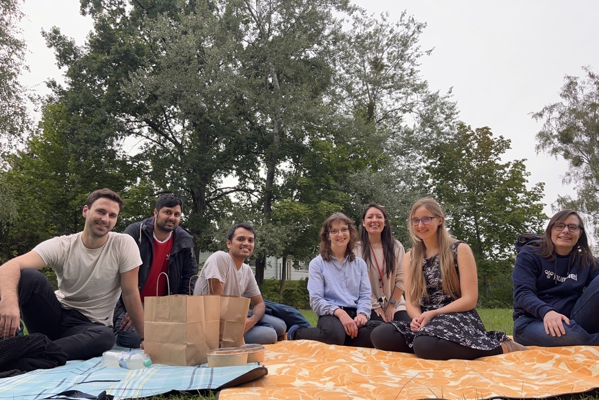

---
# You don't need to edit this file, it's empty on purpose.
# Edit theme's home layout instead if you wanna make some changes
# See: https://jekyllrb.com/docs/themes/#overriding-theme-defaults
layout: home
---

This is the website of the junior group "Computational Materials Design" at the <a href="https://www.bam.de/Content/EN/Standard-Articles/About-us/Jobs-and-Careers/Young-Science/junior-research-group-george-computational-materials-design.html">Federal Institute for Materials Research and Testing in Germany</a> (CMD@BAM), which is also associated with the <a href="https://www.uni-jena.de/">FSU Jena</a>, headed by Prof. Janine George. On this website, you will find information on our research, the group and Janine. Our current research focuses on data analysis and high-throughput computing for materials discovery. We are also experts in electronic structure computations, computational bonding analysis and phonon computations.

If you are interested in doing a Bachelor or Master thesis, a research stay, or a postdoc in our group, you can contact us via mail.

